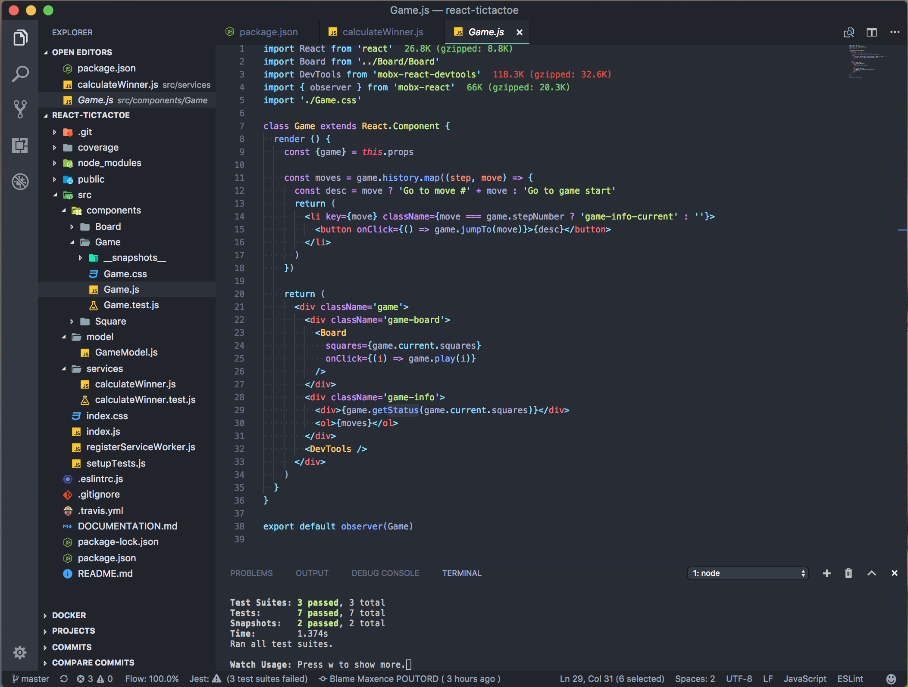

# Dotfiles

This setup is intended for: 

* :penguin: Ubuntu
* :penguin: Unix Server (CLI/Bash only)
* :apple: MacOS

Special thanks to whoever I stole it from :kissing_heart:

👉 [Full list of Apps, Tools, and Gear I Use](https://www.maxpou.fr/uses)

## Dotfiles installation

```bash
# Ubuntu / MacOS:
git clone https://github.com/maxpou/dotfiles.git --recursive
cd dotfiles && bin/install

# Unix server:
cd dotfiles && bin/install_server
```

## Application

* [Visual Studio Code (VS Code)](https://code.visualstudio.com)
* [iTerm] - a terminal (but, I mainly use the CLI in VS Code)
* [Postman](https://chrome.google.com/webstore/detail/postman/fhbjgbiflinjbdggehcddcbncdddomop): tool to develop API
* [Sequel Pro](https://www.sequelpro.com/) - a GUI for MySQL
* [Giphy Capture](https://giphy.com/apps/giphycapture) - a screen recorder
* [Node/NPM](https://nodejs.org/en/)

## VSCode

* [Plugins that I Can't Live Without](./vscode/install_plugin.sh)
* [Settings](./vscode/settings.json)
* [Keybindings](./vscode/keybindings.json)



## Command Line Apps

* [Zsh](https://github.com/robbyrussell/oh-my-zsh/wiki/Installing-ZSH)
* [Oh My Zsh](https://github.com/robbyrussell/oh-my-zsh): A framework to manage Zsh configuration
* [Hub](https://github.com/github/hub): a wrapper for Git command *(Git+Hub=GitHub)*
* [thefuck](https://github.com/nvbn/thefuck#installation): corrects the previous console command
* [lighthouse (CLI)](https://github.com/GoogleChrome/lighthouse#cli-options): *(requires NPM)* Auditing, performance metrics, and best practices for Progressive Web Apps
* [gtop](https://github.com/aksakalli/gtop) *(requires NPM)*
* [curl](https://github.com/curl/curl)
* [Tree](https://formulae.brew.sh/formula/tree)


## Browser - Brave (main)

Extensions list for Brave (it's a chrome-based browser):

* [Pocket (Save to Pocket)](https://chrome.google.com/webstore/detail/save-to-pocket/niloccemoadcdkdjlinkgdfekeahmflj): best read it later I found ❤️
* [uBlock Origin](https://chrome.google.com/webstore/detail/ublock-origin/cjpalhdlnbpafiamejdnhcphjbkeiagm): best add blocker I found
* [Privacy Badger](https://chrome.google.com/webstore/detail/privacy-badger/pkehgijcmpdhfbdbbnkijodmdjhbjlgp): block trackers

Dev plugins:
* [Vue.js devtools](https://chrome.google.com/webstore/detail/vuejs-devtools/nhdogjmejiglipccpnnnanhbledajbpd): a must-have for VueJS developement
* [React Developer Tools](https://chrome.google.com/webstore/detail/react-developer-tools/fmkadmapgofadopljbjfkapdkoienihi): a must-have for React developement
* [Web Vitals](https://chrome.google.com/webstore/detail/web-vitals/ahfhijdlegdabablpippeagghigmibma)
* [Axe](https://chrome.google.com/webstore/detail/axe-devtools-web-accessib/lhdoppojpmngadmnindnejefpokejbdd) great tool for Web Accessibility Testing

## Browser - Firefox (second)

Extensions list for Firefox:

* Pocket (Save to Pocket): best read it later I found ❤️ (added by default)
* [Momentum](https://addons.mozilla.org/en-US/firefox/addon/momentumdash/): every day a new magnificent picture
* [Grammarly](https://addons.mozilla.org/fr/firefox/addon/grammarly-1/): flags mistakes, typos...
* [uBlock Origin](https://addons.mozilla.org/en-US/firefox/addon/momentumdash/): can't live without addblocker
* [Wappalyzer](https://addons.mozilla.org/en-US/firefox/addon/wappalyzer/): detect technologies behind a website
* [LastPass](https://addons.mozilla.org/en-US/firefox/addon/lastpass-password-manager/): My Password Manager

Dev plugins:
* [Vue.js devtools](https://addons.mozilla.org/en-US/firefox/addon/vue-js-devtools/): a must-have for VueJS developement
