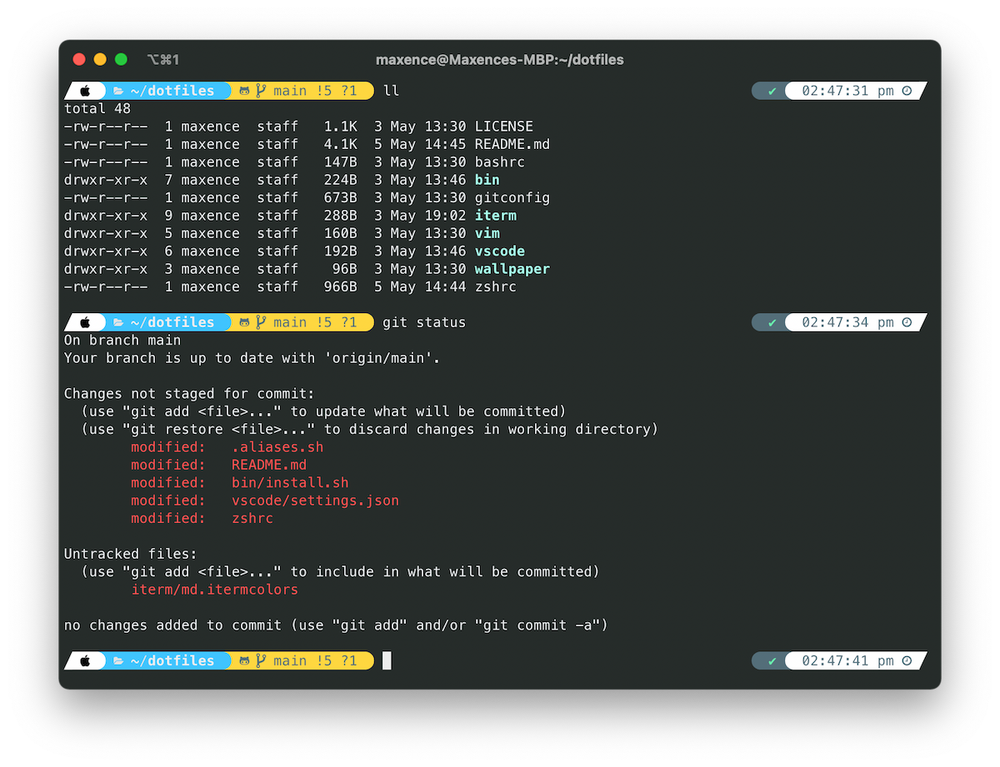

# Dotfiles

This setup is intended for: 

* :apple: MacOS
* :penguin: Ubuntu
* :penguin: Unix Server (CLI/Bash only)

Special thanks to whoever I stole it from :kissing_heart:

👉 [Full list of Apps, Tools, and Gear I Use](https://www.maxpou.fr/uses)

## Dotfiles installation

```bash
# Ubuntu / MacOS:
git clone https://github.com/maxpou/dotfiles.git
cd dotfiles && bin/install.sh

# Unix server:
cd dotfiles && bin/install_server.sh
```

## Application

* [Visual Studio Code (VS Code)](https://code.visualstudio.com)
* [iTerm2](https://iterm2.com/) - a terminal (but, I mainly use the CLI in VSCode)
* [pgAdmin](https://www.pgadmin.org) - a GUI for PostgreSQL
* [Compass](https://www.mongodb.com/products/tools/compass) - a GUI for MongoDB
* [Giphy Capture](https://giphy.com/apps/giphycapture) - a screen recorder

## VSCode


* [Plugins that I Can't Live Without](./vscode/install_plugin.sh)
* [Settings file](./vscode/settings.json)
* [Keybindings file](./vscode/keybindings.json)


## Command-line Apps



**Highlights:**  
* [Zsh](https://github.com/robbyrussell/oh-my-zsh/wiki/Installing-ZSH) + [Oh My Zsh](https://github.com/robbyrussell/oh-my-zsh): a framework to manage Zsh configuration
* [Starship](https://starship.rs/): a customizable shell
* [lighthouse (CLI)](https://github.com/GoogleChrome/lighthouse#cli-options): *(requires NPM)* Auditing, performance metrics, and best practices for Progressive Web Apps
* [gtop](https://github.com/aksakalli/gtop): a system monitoring dashboard *(requires NPM)*
* [Tree](https://formulae.brew.sh/formula/tree): display directories as trees
* [SpaceVim](https://spacevim.org): an IDE in my terminal. Mostly use it with git and when I need to open a big file.

**Configuration:**  
* [List of npm global package](./bin/install-npm-globals.sh)
* [List of homebrew formulae](./bin/install-brew.sh)
* [Starship custom theme](./starship.toml)
* [[iterm2] Colors config file](./iterm/md.itermcolors) - Using minimal apparence (preference > apparence > theme: minimal)

## Browser - Brave (main)

Extensions list for Brave (it's a chrome-based browser):

* [uBlock Origin](https://chrome.google.com/webstore/detail/ublock-origin/cjpalhdlnbpafiamejdnhcphjbkeiagm): best ad blocker I found
* [Privacy Badger](https://chrome.google.com/webstore/detail/privacy-badger/pkehgijcmpdhfbdbbnkijodmdjhbjlgp): block trackers
* [Grammarly](https://chrome.google.com/webstore/detail/grammarly-for-chrome/kbfnbcaeplbcioakkpcpgfkobkghlhen/related?hl=en): helps for typos
* [LastPass](https://chrome.google.com/webstore/detail/lastpass-free-password-ma/hdokiejnpimakedhajhdlcegeplioahd?hl=fr): my Password Manager
* [YoutubeMate (Paid)](https://chromewebstore.google.com/detail/youtubemate-get-the-gist/gfdoidpbnajnmfpibbcjlbdfbhmfaode): generates summaries of YouTube videos with ChatGPT/Gemini (note: I built this tool)

Dev plugins:
* [React Developer Tools](https://chrome.google.com/webstore/detail/react-developer-tools/fmkadmapgofadopljbjfkapdkoienihi): a must-have for React developement
* [Vue.js devtools](https://chrome.google.com/webstore/detail/vuejs-devtools/nhdogjmejiglipccpnnnanhbledajbpd): a must-have for VueJS developement
* [Web Vitals](https://chrome.google.com/webstore/detail/web-vitals/ahfhijdlegdabablpippeagghigmibma)
* [Axe](https://chrome.google.com/webstore/detail/axe-devtools-web-accessib/lhdoppojpmngadmnindnejefpokejbdd) great tool for Web Accessibility Testing

## Browser - Firefox (second)

Extensions list for Firefox:

* [Grammarly](https://addons.mozilla.org/fr/firefox/addon/grammarly-1/): flags mistakes, typos...
* [uBlock Origin](https://addons.mozilla.org/en-US/firefox/addon/momentumdash/): best ad blocker I found
* [LastPass](https://addons.mozilla.org/en-US/firefox/addon/lastpass-password-manager/): My Password Manager
